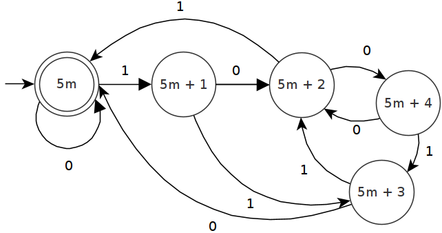

# Automaton

A simple automaton machine that determines whether a given binary number is divisible by 5 or not.

## Automaton description

The following are the parts of the automaton $A=<Q,\Sigma,\delta,q_0>$ where:

- $Q:\{5m,5m+1,5m+2,5m+3,5m+4\}$
- $\Sigma=\{0, 1\}$
- $\delta=Q\times\Sigma \rightarrow Q$
- $q_0=5m$

## States diagram

  
